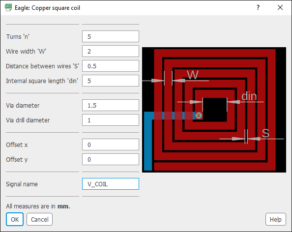
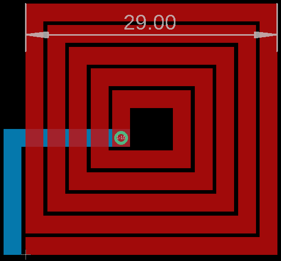
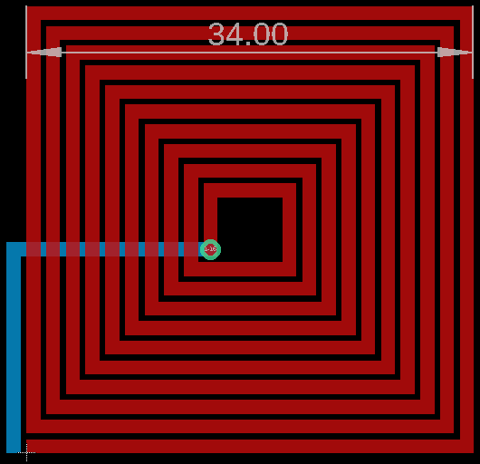
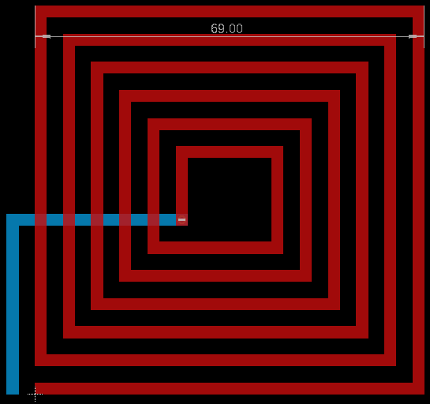
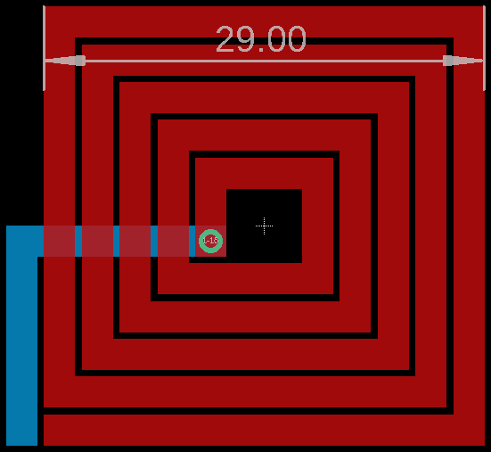

# Square coil in [EAGLE](https://www.autodesk.com/products/eagle/overview)
This project is an Autodesk EAGLE ULP (User Language Program) to place a square coil in a board.

## Get started
1. Clone this repository in `<My Documents>/EAGLE/ulps/`.
2. Open a board in EAGLE.
3. Go to "File" > "Run ULP..." (or click on the orange square that says "ULP").
4. Click on "Browse...".
5. Select the ULP file `square-coil.ulp`.  
Steps 3 to 5 can be omitted by directly running the command `run square-coil.ulp` in EAGLE's command line.

The following dialog box will appear:  

In the dialog box, modify the parameters according to the coil you want to place.

## Examples

| n | W | S | din | Offset x | Offset y | Resulting coil |
| :---: | :---: | :---: | :---: | :---: | :---: | :---: |
| 5 | 2 | 0.5 | 5 | 0 | 0 |  |
| 10 | 1 | 0.5 | 5 | 0 | 0 |  |
| 6 | 2 | 3 | 15 | 0 | 0 |  |
| 5 | 2 | 0.5 | 5 | -14.5 | -14.5 |  |
